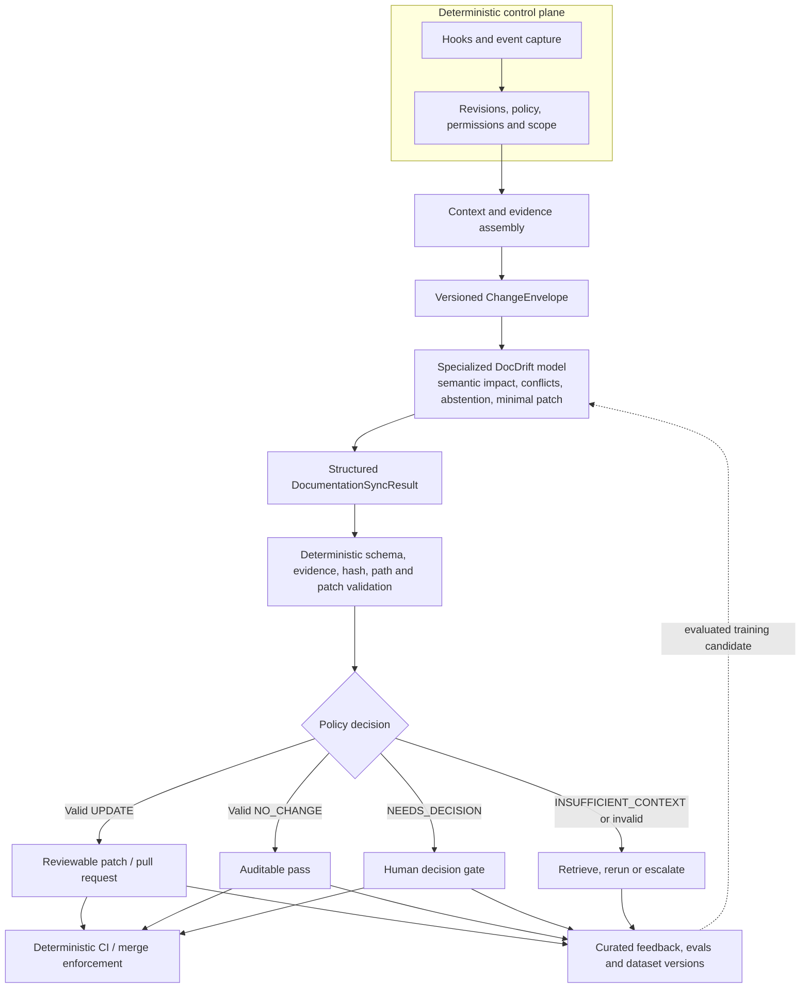

# DocDrift

**Documentation that evolves with your system.**

[](https://github.com/paulotvlincelia/docdrift/actions/workflows/ci.yml)
[](docs/roadmap.md)
[](docs/adr/0003-gemma-4-e2b.md)
[](pyproject.toml)
[](https://github.com/paulotvlincelia/docdrift/discussions)

DocDrift is an open research and engineering project for keeping **requirements, architectural decisions, code, tests, and documentation aligned throughout the SDLC**.

The project is building a specialized, locally deployable model based on [`google/gemma-4-E2B-it`](https://huggingface.co/google/gemma-4-E2B-it). Given a versioned change episode, the model determines whether documentation must change, identifies the affected documents, surfaces unresolved conflicts, and proposes minimal evidence-backed patches.

> DocDrift is not another documentation generator. It is an experiment in making documentation continuity enforceable.

## Why DocDrift?

Documentation usually starts correct and drifts over time. A feature is adjusted directly in code. An ADR is superseded but remains referenced. A hotfix changes operational behavior. A requirement is renegotiated during implementation. Each individual action makes sense, yet the documentation slowly stops describing the product that actually exists.

The root cause is not a lack of hooks or Markdown generators. Decisions and behavioral changes cross issue trackers, requirements, ADRs, code, tests, schemas, runbooks, and releases. Traditional enforcement can reliably observe that an event happened, but it does not consistently determine what that event means across those artifacts. A changed path is easy to detect; whether the change alters a documented guarantee, contradicts an ADR, or is only an internal refactor is a semantic question.

Frameworks and agent instructions help only when people remember to use them. DocDrift explores a different approach:

```text
capture every relevant change
    -> reconstruct its SDLC context
    -> reason about documentation impact
    -> validate the proposed update
    -> enforce or escalate the result
```

## The core contract

DocDrift consumes a [`ChangeEnvelope`](schemas/change-envelope.schema.json) containing the relevant requirement, ADR, issue or pull request, code/test/schema diffs, candidate documents, and project policy.

It produces a validated [`DocumentationSyncResult`](schemas/documentation-sync-result.schema.json) with one of four decisions:

| Decision | Meaning |
|---|---|
| `UPDATE` | The documentation is affected and there is enough evidence to propose a patch. |
| `NO_CHANGE` | The change does not alter a documented claim. |
| `NEEDS_DECISION` | Requirements, decisions, implementation, or docs conflict. A human must decide. |
| `INSUFFICIENT_CONTEXT` | The system cannot decide safely with the available evidence. |

This distinction matters. A useful synchronizer must learn when **not** to write.

## Why not just rules and hooks?

DocDrift does use rules and hooks wherever the system has an invariant. They capture events, enforce permissions, validate schemas and evidence, apply patches, and control CI and merge gates. The model neither replaces that control plane nor receives its authority.

The narrower problem left for the specialized model is semantic judgment: relate a change in behavior or intent to claims distributed across requirements, ADRs, code, tests, and documentation; detect implicit impact or conflict; and propose the smallest supported edit. It may instead abstain with `NEEDS_DECISION` or `INSUFFICIENT_CONTEXT`.

| Best handled deterministically | Best evaluated semantically |
|---|---|
| Capture a PR, commit, requirement, or release event | Determine whether a code change alters documented behavior |
| Resolve revisions, paths, hashes, ownership, and permissions | Relate a requirement, ADR, implementation, test, and document claim |
| Assemble a versioned input and enforce token/context limits | Detect implicit documentary impact and cross-artifact conflicts |
| Validate JSON, evidence references, anchors, and patch applicability | Distinguish a refactor from a behavior or contract change |
| Apply an approved patch and enforce CI/merge policy | Propose a minimal evidence-backed patch or abstain |

A rules-only engine remains useful as a baseline and for known mappings such as “an OpenAPI change requires API-reference review.” It becomes brittle when the same behavior is expressed through different languages, frameworks, repository layouts, document types, or indirect changes. Covering those combinations with path rules, symbol rules, templates, and exceptions moves semantic judgment into an expanding rule set without removing the ambiguity.

DocDrift therefore tests a hybrid design: **determinism for invariants and learned judgment for bounded ambiguity**. A small task-specific model is intended to make that learned layer deployable on local or controlled infrastructure, with versioned weights and inference settings. If evaluation supports the hypothesis, it can offer lower and more predictable cost, stronger privacy, and tighter task behavior than calling a frontier model for every change. These are research goals, not current benchmark claims: fine-tuning earns its place only if it outperforms deterministic, zero-shot, and few-shot baselines on repository-disjoint evaluations without increasing critical failures.

This boundary is also what keeps the design from becoming an LLM-controlled workflow. Hooks still observe every relevant path through the SDLC; one bounded component handles the meaning that hooks cannot encode consistently; deterministic code then verifies and enforces the result.

## How it works



The model performs semantic judgment and patch generation. Deterministic code remains responsible for event capture, context assembly, schema validation, evidence checks, patch application, permissions, and merge policy. Feedback never flows directly into training: it is curated, provenance-checked, versioned, and evaluated before a model can be promoted.

### Safety contract

- The model **never authorizes a merge** and cannot weaken branch protection, permissions, or project policy.
- It must not invent a product or architecture decision. Conflicting authority returns `NEEDS_DECISION`; missing evidence returns `INSUFFICIENT_CONTEXT`.
- Every impacted document and edit must cite evidence present in the versioned input. Missing references, stale hashes, ambiguous anchors, forbidden paths, and invalid operations are rejected.
- `NO_CHANGE` is a reviewable, auditable claim rather than silent inaction.
- Confidence is diagnostic metadata. It never replaces schema checks, evidence validation, policy, CI, or human gates.
- A valid model response is still only a proposal. Patch application and enforcement are deterministic actions with normal repository permissions.

See the [system architecture](docs/architecture/system.md) for component boundaries and failure modes, and [SDLC enforcement](docs/operations/enforcement.md) for rollout and gate behavior.

## Training and model promotion

DocDrift deliberately separates local experimentation, official promotion, and local consumption:

```text
Local development (supported)
    Apple Silicon -> MLX-LM -> LoRA/QLoRA -> local evals

Canonical promotion (required for official artifacts)
    Colab/CUDA -> reproducible training -> official evals -> promotion gates -> Hugging Face

Manual consumption / QA (optional)
    promoted compatible artifact -> LM Studio -> local inference, demos and API testing
```

MLX-LM enables low-cost contributor iteration on Apple Silicon and may be used for substantial training when local resources permit. The canonical promotion path remains backend-controlled so that official results are reproducible and comparable. LM Studio is intentionally downstream of training: it is useful for manual QA, demos and local serving, but it is not a DocDrift fine-tuning backend or a substitute for the official evaluation gates.

See the full [training strategy](docs/training/strategy.md) and [Apple Silicon workflow](docs/training/local-apple-silicon.md).

## Project status

DocDrift is currently a **research preview**. The repository contains the initial architecture, data contracts, curation strategy, training plan, evaluation framework, and validation scaffolding.

It does **not** yet contain a released dataset, fine-tuned adapter, production GitHub integration, or benchmark results. Those artifacts will only be published with reproducible evaluation and documented provenance.

## Repository map

| Path | Purpose |
|---|---|
| [`docs/product`](docs/product/vision.md) | Product vision, users, scope, and success criteria |
| [`docs/architecture`](docs/architecture/system.md) | System boundaries and data flow |
| [`docs/dataset`](docs/dataset/specification.md) | Dataset contract, mining, curation, and dataset card |
| [`docs/training`](docs/training/strategy.md) | Gemma 4 E2B fine-tuning strategy and model card |
| [`docs/evaluation`](docs/evaluation/plan.md) | Metrics, splits, challenge set, and promotion gates |
| [`docs/operations`](docs/operations/enforcement.md) | Hooks, CI gates, rollout modes, and auditability |
| [`docs/adr`](docs/adr) | Architecture Decision Records for DocDrift itself |
| [`schemas`](schemas) | Versioned JSON Schemas for model input and output |
| [`examples`](examples) | Small contract examples used by tests and tooling |
| [`configs`](configs) | Draft dataset, training, and evaluation configurations |

## Quick start

The current CLI validates DocDrift contracts while the training and runtime pipelines are being built.

```bash
git clone https://github.com/paulotvlincelia/docdrift.git
cd docdrift

python3 -m venv .venv
source .venv/bin/activate
pip install -e '.[dev]'

pytest
docdrift validate \
  examples/change-envelope.json \
  examples/documentation-sync-result.json
```

Expected output:

```text
contracts valid
```

Apple Silicon contributors can also run the local [MLX smoke test](docs/training/local-apple-silicon.md) to validate Gemma 4 inference and LoRA training on Metal.

Experiments may run locally or on Colab. Promotion follows a backend-neutral [training operating model](docs/training/operating-model.md): canonical CUDA reproduction, clean evaluation, Hugging Face staging, and an immutable release.

## Research plan

DocDrift is being developed in evidence-driven stages:

1. establish zero-shot, few-shot, and deterministic baselines;
2. build a repository-disjoint challenge set;
3. mine license-aware change episodes from public repositories;
4. curate Silver and Gold examples, including negative and abstention cases;
5. fine-tune Gemma 4 E2B with QLoRA;
6. evaluate grounding, impact detection, patch quality, latency, and memory;
7. integrate with GitHub in non-blocking observation mode;
8. graduate carefully toward documentation gates.

Follow the detailed [roadmap](docs/roadmap.md) and join the [Discussions](https://github.com/paulotvlincelia/docdrift/discussions) to help shape priorities.

## Where contributions can have the most impact

DocDrift needs more than model training. Contributions are welcome in:

- mining and reconstructing real change episodes;
- license and provenance tracking;
- ADR, requirement, and documentation parsers;
- repository-aware retrieval and co-change analysis;
- evaluation cases from real SDLC failures;
- patch validation and grounding metrics;
- Portuguese and multilingual technical documentation;
- integrations with GitHub, GitLab, Jira, Linear, and documentation platforms;
- privacy, security, and prompt-injection defenses;
- technical writing and community education.

Start with [CONTRIBUTING.md](CONTRIBUTING.md), browse issues labeled [`good first issue`](https://github.com/paulotvlincelia/docdrift/labels/good%20first%20issue), or propose a research direction in Discussions.

## Principles

- **Evidence before edits.** Every changed claim should point to its source.
- **Abstention is a valid result.** The model must not invent product or architecture decisions.
- **Minimal patches.** Preserve unaffected content, authorship, and document structure.
- **Context is versioned.** Inputs, outputs, model versions, and policies must be reproducible.
- **The model proposes; code verifies.** Enforcement and authorization remain deterministic.
- **Community data deserves governance.** Provenance, licensing, privacy, and removal processes are part of the product.

## Naming

- Project and CLI: **DocDrift** / `docdrift`
- Dataset: **DocDrift-ChangeEpisodes**
- Initial model: **DocDrift-Gemma-4-E2B**

## License

The repository license is being finalized before the first public release. Dataset and model artifacts may require separate licenses and notices based on their sources. Until a license is added, standard copyright restrictions apply.

## Stay involved

- Share a real documentation-drift failure in [Discussions](https://github.com/paulotvlincelia/docdrift/discussions).
- Open a dataset or evaluation proposal using the issue templates.
- Watch or star the repository to follow the first benchmark and fine-tuning experiments.
- Review the [architecture](docs/architecture/system.md) and challenge assumptions early.

If software evolution is continuous, its documentation should be too.
