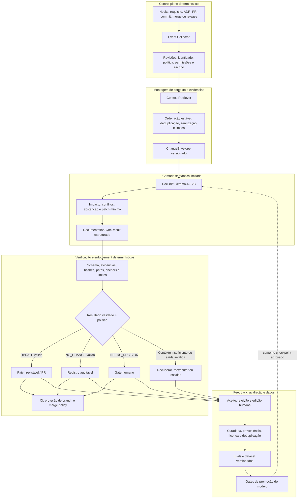

# Arquitetura do sistema

## Visão geral

O DocDrift é um sistema híbrido, não um agente com autoridade sobre o repositório. Código determinístico captura e delimita o episódio, monta evidências, valida a saída, aplica políticas e controla qualquer efeito. Um modelo pequeno e especializado atua somente onde o problema exige julgamento semântico entre artefatos.

A fronteira responde à causa raiz do drift: requisitos, decisões, implementação, testes e documentação mudam em ferramentas e momentos diferentes. Hooks observam esses eventos com precisão, mas um evento como `src/auth/session.py changed` não informa, por si só, se uma garantia pública, uma decisão arquitetural ou um runbook foi afetado. O modelo tenta interpretar essa relação; ele não decide o que pode ser executado.

## Por que a arquitetura é híbrida

Automação determinística é a escolha correta quando existe uma regra verificável: um hash corresponde ou não, um path é permitido ou não, um schema é válido ou não, uma proteção de branch foi satisfeita ou não. O DocDrift não usa inferência para essas decisões.

O espaço restante não é apenas uma tabela de paths. A mesma mudança de comportamento pode aparecer como alteração de schema, flag, teste, configuração ou combinação de commits; a mesma afirmação pode existir em um ADR, guia, runbook ou requisito com vocabulário diferente. Regras cobrem bem convenções conhecidas, mas tendem a acumular exceções por stack, layout, tipo documental e expressão indireta da mudança. Elas continuam sendo usadas na recuperação e como baseline, sem serem tratadas como solução completa para semântica cross-artifact.

O modelo especializado recebe uma tarefa delimitada, input e output versionados e quatro decisões possíveis. A hipótese do projeto é que um modelo pequeno fine-tunado possa superar regras e prompting genérico nessa camada, mantendo execução local ou privada, custo previsível e comportamento mais controlável que um modelo de fronteira. Essa hipótese ainda depende de benchmark: nenhuma versão é promovida sem ganho em repositórios não vistos, grounding e ausência de regressão em falhas críticas.

Essa divisão reduz complexidade acidental: invariantes não precisam ser reaprendidos pelo modelo, enquanto relações semânticas não precisam ser reimplementadas como uma matriz crescente de regras frágeis.

## Componentes

### Event Collector

Normaliza eventos de Git, pull requests, issues, requisitos, ADRs e releases. Não interpreta semanticamente a mudança.

Responsabilidades:

- preservar IDs, timestamps e hashes;
- identificar o estado anterior e posterior;
- agrupar eventos em um episódio;
- eliminar duplicatas e reprocessamentos acidentais.

### Context Retriever

Seleciona evidências candidatas antes da inferência:

- documentos vigentes e seus trechos relevantes;
- requisitos e suas revisões;
- ADRs ativos, substituídos ou relacionados;
- diffs de código, testes, schemas e configuração;
- metadados de issue e pull request;
- políticas documentais do projeto.

O recuperador pode combinar paths, referências explícitas, símbolos, co-change e embeddings. O contexto longo do modelo não justifica enviar o repositório inteiro.

A recuperação é parte da montagem controlada de evidências. Métodos aprendidos podem ranquear candidatos, mas o runtime registra a estratégia, os itens omitidos e truncamentos. O modelo não pode buscar livremente conteúdo fora do envelope nem converter conteúdo recuperado em política.

### ChangeEnvelope Builder

Produz a entrada canônica definida em [`schemas/change-envelope.schema.json`](../../schemas/change-envelope.schema.json). O builder deve ordenar o contexto de forma estável e registrar truncamentos.

### Synchronizer Model

Executa duas tarefas lógicas, mesmo que inicialmente sejam servidas pelo mesmo checkpoint:

1. `analyze_documentation_impact`;
2. `generate_documentation_patch`.

A separação permite avaliar análise e geração independentemente e evita que a existência de um patch force uma decisão `UPDATE`.

Responsabilidades semânticas:

- interpretar mudança de comportamento ou intenção;
- relacionar requisito, ADR, issue/PR, código, testes, schemas e documentos;
- detectar impacto documental implícito e contradições entre autoridades;
- distinguir mudança de contrato de refatoração interna;
- propor operações mínimas sustentadas pelas evidências recebidas;
- retornar `NO_CHANGE`, `NEEDS_DECISION` ou `INSUFFICIENT_CONTEXT` quando editar não for seguro.

O modelo não resolve qual artefato conflitante está correto, não cria requisitos ausentes, não escolhe política organizacional e não autoriza efeitos no repositório.

### Validators

Validam:

- conformidade com JSON Schema;
- existência dos paths e âncoras usados no patch;
- presença das evidências citadas na entrada;
- hashes do documento anterior;
- aplicabilidade não ambígua das operações;
- limites de tamanho e número de alterações;
- ausência de modificação em arquivos proibidos.

Um resultado inválido não é convertido em aprovação por possuir confiança alta. Confidence é telemetria para avaliação e triagem; não substitui nenhuma validação ou gate.

### Integration Adapter

Converte um resultado validado em comentário, check de CI, pull request ou tarefa de decisão. A política é específica de cada organização e não fica codificada nos pesos do modelo.

Somente esse plano determinístico, operando com as credenciais e permissões configuradas, pode criar ou aplicar uma alteração. O modelo nunca autoriza merge e não pode enfraquecer proteções de branch.

### Feedback Collector

Registra aceitação, rejeição, edição humana e motivo. Nenhum feedback entra automaticamente no treino sem curadoria, deduplicação e revisão de licença/privacidade.

## Limites de responsabilidade

| Responsabilidade | Código determinístico | Modelo especializado |
|---|:---:|:---:|
| Capturar eventos e resolver revisões | Sim | Não |
| Selecionar e versionar contexto inicial | Sim | Não |
| Interpretar impacto semântico | Não | Sim |
| Relacionar evidências dentro do envelope | Parcial | Sim |
| Detectar conflito ou necessidade de abstenção | Valida a forma | Propõe a decisão |
| Gerar conteúdo mínimo do patch | Não | Sim |
| Validar schema, evidências, hashes, paths e anchors | Sim | Não |
| Aplicar o patch | Sim | Não |
| Autorizar CI ou merge | Sim | Não |
| Criar registro de auditoria | Sim | Não |
| Curar feedback e promover modelo | Sim, com revisão humana | Não |

## Contrato de falha segura

| Modo de falha | Resposta obrigatória |
|---|---|
| Requisito, ADR e implementação entram em conflito | `NEEDS_DECISION`, sem patch; uma pessoa define a autoridade |
| Evidência essencial está ausente ou truncada | `INSUFFICIENT_CONTEXT`, sem patch; recuperar ou escalar |
| O episódio não altera uma afirmação documentada | `NO_CHANGE` com resultado auditável |
| Evidência citada não existe no `ChangeEnvelope` | Rejeitar a saída |
| Hash, path ou anchor não corresponde ao documento analisado | Rejeitar o patch e não aplicar parcialmente |
| Patch tenta tocar path proibido ou exceder limites | Rejeitar por política |
| Saída não satisfaz o JSON Schema | Rejeitar antes de qualquer integração |
| Confidence é alta, mas um gate falha | O gate prevalece; confidence não concede autoridade |
| Conteúdo tenta instruir o modelo a ignorar a política | Tratar como dado não confiável; validar a saída normalmente |
| Modelo falha, expira ou produz resultado inconsistente | Falhar fechado conforme política: reexecutar, pedir contexto ou revisão humana |

Uma resposta estruturalmente válida ainda é uma proposta. Para `UPDATE`, toda edição precisa apontar para evidência presente no `ChangeEnvelope`; para conflitos ou lacunas, o schema impede patches. `NO_CHANGE` também permanece disponível para auditoria e pode ser contestado por revisores ou por políticas de maior risco.

## Segurança e privacidade

- O pipeline deve suportar execução inteiramente privada.
- Secrets e PII devem ser removidos antes da persistência e do treino.
- Dados de clientes não podem ser misturados ao dataset público.
- Todo exemplo público deve preservar proveniência e licença.
- Patches produzidos pelo modelo devem passar pelas mesmas permissões e proteções de branch que alterações humanas.

## Reprodutibilidade e aprendizado

Cada execução registra o hash do envelope, versões de schema, modelo e adapter, parâmetros de inferência, política e resultado bruto/validado. Execução local reduz exposição de código e documentos, mas não elimina os requisitos de redaction, controle de acesso e retenção.

Feedback de revisão não altera o modelo em produção. Aceites, rejeições e edições passam por curadoria, proveniência, licença, privacidade, deduplicação, separação de splits e avaliações. Um novo checkpoint só entra no runtime após os gates de promoção descritos no [plano de avaliação](../evaluation/plan.md).
