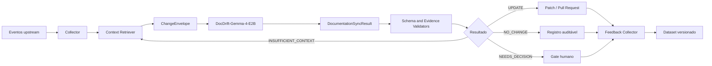

# Arquitetura do sistema

## Visão geral

O sistema combina automação determinística com um modelo fine-tunado. O modelo realiza julgamento semântico; o restante do pipeline preserva contexto, executa validações e integra o resultado ao fluxo de desenvolvimento.

## Componentes

### Event Collector

Normaliza eventos de Git, pull requests, issues, requisitos, ADRs e releases. Não interpreta semanticamente a mudança.

Responsabilidades:

- preservar IDs, timestamps e hashes;
- identificar o estado anterior e posterior;
- agrupar eventos em um episódio;
- eliminar duplicatas e reprocessamentos acidentais.

### Context Retriever

Seleciona evidências candidatas antes da inferência:

- documentos vigentes e seus trechos relevantes;
- requisitos e suas revisões;
- ADRs ativos, substituídos ou relacionados;
- diffs de código, testes, schemas e configuração;
- metadados de issue e pull request;
- políticas documentais do projeto.

O recuperador pode combinar paths, referências explícitas, símbolos, co-change e embeddings. O contexto longo do modelo não justifica enviar o repositório inteiro.

### ChangeEnvelope Builder

Produz a entrada canônica definida em [`schemas/change-envelope.schema.json`](../../schemas/change-envelope.schema.json). O builder deve ordenar o contexto de forma estável e registrar truncamentos.

### Synchronizer Model

Executa duas tarefas lógicas, mesmo que inicialmente sejam servidas pelo mesmo checkpoint:

1. `analyze_documentation_impact`;
2. `generate_documentation_patch`.

A separação permite avaliar análise e geração independentemente e evita que a existência de um patch force uma decisão `UPDATE`.

### Validators

Validam:

- conformidade com JSON Schema;
- existência dos paths e âncoras usados no patch;
- presença das evidências citadas na entrada;
- hashes do documento anterior;
- aplicabilidade não ambígua das operações;
- limites de tamanho e número de alterações;
- ausência de modificação em arquivos proibidos.

### Integration Adapter

Converte um resultado validado em comentário, check de CI, pull request ou tarefa de decisão. A política é específica de cada organização e não fica codificada nos pesos do modelo.

### Feedback Collector

Registra aceitação, rejeição, edição humana e motivo. Nenhum feedback entra automaticamente no treino sem curadoria, deduplicação e revisão de licença/privacidade.

## Limites de responsabilidade

| Responsabilidade | Modelo | Código determinístico |
|---|:---:|:---:|
| Interpretar impacto semântico | Sim | Não |
| Relacionar evidências candidatas | Sim | Parcial |
| Selecionar contexto inicial | Não | Sim |
| Decidir política de merge | Não | Sim |
| Gerar conteúdo do patch | Sim | Não |
| Validar JSON e paths | Não | Sim |
| Aplicar o patch | Não | Sim |
| Criar registro de auditoria | Não | Sim |

## Segurança e privacidade

- O pipeline deve suportar execução inteiramente privada.
- Secrets e PII devem ser removidos antes da persistência e do treino.
- Dados de clientes não podem ser misturados ao dataset público.
- Todo exemplo público deve preservar proveniência e licença.
- Patches produzidos pelo modelo devem passar pelas mesmas permissões e proteções de branch que alterações humanas.
