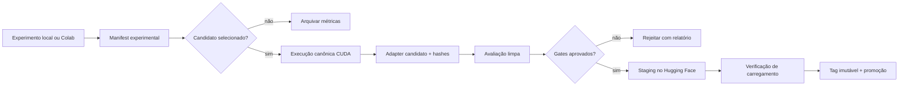

# Modelo operacional de treinamento e promoção

## Princípio

O pipeline DocDrift aceita experimentos em qualquer ambiente capaz de cumprir o contrato da execução. Um colaborador pode executar inferência, avaliação e fine-tuning localmente com MLX em Apple Silicon ou com CUDA em hardware próprio. O local da execução, porém, não torna um artefato promovível.

Para a primeira fase do projeto, o executor de referência para candidatos a release será um notebook versionado executado em Colab com CUDA. Colab é uma implementação conveniente do estágio canônico, não a fonte de verdade: recursos, tipo de GPU, limites e tempo de vida do runtime podem variar. Código, configuração, dataset, revisões e manifests permanecem versionados fora do notebook.

## Estados de uma execução

| Estado | Executor permitido | Finalidade | Pode publicar em `main` no Hugging Face? |
|---|---|---|:---:|
| `experimental` | MLX, CUDA local, Colab ou outro | Desenvolvimento, profiling e ablações | Não |
| `candidate` | Executor CUDA conforme o contrato; inicialmente Colab | Reproduzir uma configuração selecionada | Não |
| `qualified` | Avaliação limpa e independente do treino | Aplicar os gates de qualidade e segurança | Não |
| `promoted` | Upload controlado a partir do candidato qualificado | Release versionada | Sim |
| `rejected` | Qualquer | Preservar evidência de falha sem promover | Não |

## Contrato de uma execução

Toda execução que possa influenciar uma decisão deve produzir um manifest contendo, no mínimo:

- ID e estado da execução;
- commit do código e estado do worktree;
- modelo base, revisão imutável e licença observada;
- dataset, revisão imutável e hashes dos splits;
- configuração resolvida e seu hash;
- backend, sistema operacional, acelerador e memória disponível;
- versões de Python, framework, drivers e dependências;
- seeds, comandos e política de retomada;
- hashes dos checkpoints e adapters produzidos;
- métricas, duração, pico de memória e falhas;
- referência ao relatório de avaliação e decisão de promoção.

O notebook deve ser um orquestrador fino. Transformações de dados, treino, avaliação e criação do manifest pertencem a módulos e comandos testáveis do repositório.

## Faixa local para colaboradores

A execução local é uma parte suportada do pipeline, não um caminho de segunda classe. Ela pode:

- validar o dataset e o chat template;
- executar baselines e avaliações;
- medir memória e throughput;
- treinar adapters experimentais;
- reproduzir bugs e comparar configurações;
- propor um candidato acompanhado de manifest e métricas.

O projeto não exige Apple Silicon. MLX é o backend local atualmente validado; CUDA local poderá executar o mesmo contrato. Um colaborador sem GPU também deve conseguir validar contratos, preparar dados e inspecionar manifests sem baixar o modelo.

### Fronteira de compatibilidade

Adapters MLX e adapters PEFT/Transformers não são assumidos como intercambiáveis. Diferenças de módulos-alvo, quantização, nomes de pesos, kernels e serialização podem produzir resultados distintos mesmo com hiperparâmetros nominalmente iguais.

Um resultado MLX pode chegar à promoção somente por um destes caminhos:

1. repetir o treino a partir do mesmo código, dataset e configuração semântica no estágio canônico CUDA; ou
2. usar uma conversão explicitamente suportada e passar por testes de carregamento e equivalência comportamental antes da avaliação.

Não exigimos igualdade bit a bit entre backends. Exigimos validade estrutural, ausência de regressões críticas e métricas dentro das tolerâncias registradas.

## Execução canônica no Colab

O Colab será o executor CUDA de referência enquanto simplificar o acesso da comunidade. Cada execução canônica deve:

1. iniciar de um commit limpo e identificado do GitHub;
2. instalar dependências a partir de versões resolvidas;
3. baixar modelo e dataset por revisões imutáveis;
4. registrar tipo de GPU, runtime e ambiente antes do treino;
5. gravar checkpoints retomáveis fora do disco efêmero;
6. executar treino e exportar o manifest antes de liberar o runtime;
7. executar a avaliação em processo limpo, sem reutilizar estado mutável do treino;
8. fazer upload somente para uma revisão de staging.

Como recursos do Colab não são garantidos, o pipeline não pode depender de uma GPU específica nem assumir que uma sessão sobreviverá até o fim. Runs interrompidos permanecem incompletos e nunca são promovidos silenciosamente.

O contrato deve continuar executável em outro runner CUDA compatível. Migrar de Colab para Hugging Face Jobs, uma GPU local ou outro provedor não pode exigir mudar o formato do dataset, as métricas ou os gates.

## Segredos e dados

- Tokens ficam no mecanismo de secrets do executor, nunca no notebook, output, manifest ou Git.
- O token de promoção deve ter escrita somente nos repositórios Hugging Face necessários.
- Código de pull requests não confiáveis nunca roda com um token de escrita disponível.
- O upload de promoção usa apenas código revisado da branch protegida.
- Dados proprietários podem usar o pipeline local, mas não entram em Colab ou Hugging Face sem autorização explícita.
- Dataset público exige proveniência, licença, remoção de secrets/PII e política de retirada.

## Gate de promoção ao Hugging Face

O Hugging Face funciona como registry versionado, não como prova de qualidade. Um artefato somente pode sair de staging quando:

- o manifest está completo e seus hashes conferem;
- o modelo base e o dataset estão presos a revisões imutáveis;
- o treino canônico terminou sem erro e produziu adapter carregável;
- a avaliação independente passou pelos gates definidos;
- não houve regressão em falhas críticas ou abstenção;
- licenças e proveniência foram revisadas;
- model card, dataset card, configuração e métricas acompanham o artefato;
- um teste baixa o artefato de staging e reproduz inferência;
- a decisão humana de promoção está registrada.

A promoção cria uma tag imutável. `main` pode apontar para a release recomendada, mas consumidores reproduzíveis devem usar a tag ou o commit do Hub. Um rollback muda a recomendação; não reescreve uma release publicada.

## Custos e evolução

Nem toda contribuição dispara Colab. Experimentos baratos eliminam configurações inviáveis antes do estágio canônico. O projeto registra custo e duração para que a seleção de candidatos considere ganho por recurso consumido.

Colab pode deixar de ser o executor de referência quando limites de duração, disponibilidade, automação ou governança superarem seu benefício. Essa troca não altera o contrato nem os gates; apenas o adaptador de execução.
